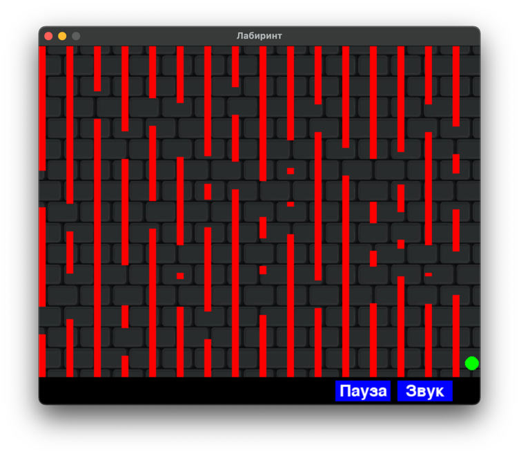

# Практическая работа №25 #

### Тема: Загрузка и сохранение изображений ###

### Цель: Совершенствование навыков составления программ с библиотекой Pygame ###

#### Задача: ####

> Создайте выбор объектов для своей игры, продумайте звуковое сопровождение или его отключение и паузу игры.

##### Контрольный пример: #####

> Получаю:
> 1) Звуковое сопровождение;
> 2) Кнопка для отключения звукового сопровождения;
> 3) Кнопка паузы.

##### Системный анализ: #####

> Входные данные: `None`    
> Промежуточные данные: `int screen_width`, `int screen_height`, `tuple black`, `tuple white`, `tuple red`,
`tuple green`, `tuple blue`, `int line_width`, `int line_gap`, `int line_offset`, `int door_width`,
`int max_openings_per_line`, `int player_radius`, `int player_speed`, `int player_x`, `int player_y`, `bool is_muted`,
`bool is_paused`, `list lines`, `int num_openings`, `list openings`, `int last_opening_bottom`,
`int button_width`, `int button_height`, `bool collided`    
> Выходные данные: `background_image`, `victory_sound.mp3`, `defeat_sound.mp3`, `game_music.mp3`
##### Блок схема: #####


##### Код программы: #####

```python
import os
import pygame
import random

# Инициализация Pygame
pygame.init()
pygame.mixer.init()

# Ширина и высота экрана
screen_width = 640
screen_height = 520
screen = pygame.display.set_mode((screen_width, screen_height))
pygame.display.set_caption('Лабиринт')

# Цвета
black = (0, 0, 0)
white = (255, 255, 255)
red = (255, 0, 0)
green = (0, 255, 0)
blue = (0, 0, 255)

# Параметры стен и дверей
line_width = 10
line_gap = 40
line_offset = 20
door_width = 40
max_openings_per_line = 5

# Параметры игрока и начальная позиция
player_radius = 10
player_speed = 2
player_x = screen_width - 12
player_y = screen_height - 60

# Загрузка и масштабирование фонового изображения
background_image = pygame.image.load('background.jpg')
background_image = pygame.transform.scale(background_image, (screen_width, screen_height - 40))

# Загрузка и настройка музыки
pygame.mixer.music.load('game_music.mp3')
victory_sound = pygame.mixer.Sound('victory_sound.mp3')
defeat_sound = pygame.mixer.Sound('defeat_sound.mp3')

# Начало воспроизведения фоновой музыки
pygame.mixer.music.play(-1)

# Переменные управления звуком и паузой
is_muted = False
is_paused = False

# Функция для отрисовки стен
def draw_walls():
    lines = []
    for i in range(0, screen_width, line_gap):
        num_openings = random.randint(1, max_openings_per_line)
        openings = sorted(random.sample(range(line_offset + door_width, screen_height - line_offset - door_width - 40), num_openings))
        last_opening_bottom = 0
        for opening_top in openings:
            if last_opening_bottom < opening_top:
                lines.append(pygame.Rect(i, last_opening_bottom, line_width, opening_top - last_opening_bottom))
            last_opening_bottom = opening_top + door_width
        if last_opening_bottom < screen_height - 40:
            lines.append(pygame.Rect(i, last_opening_bottom, line_width, screen_height - last_opening_bottom - 40))
    return lines

# Функция для отображения сообщения
def show_message(message):
    font = pygame.font.Font(None, 74)
    text = font.render(message, True, white)
    text_rect = text.get_rect(center=(screen_width // 2, screen_height // 2))
    screen.fill(black)
    screen.blit(text, text_rect)
    pygame.display.update()
    pygame.time.delay(5000)

# Функция для обработки паузы и звука
def handle_buttons():
    global is_paused, is_muted
    mouse_pos = pygame.mouse.get_pos()
    if pause_button_rect.collidepoint(mouse_pos):
        is_paused = not is_paused
        if is_paused:
            pygame.mixer.music.pause()
        else:
            if not is_muted:
                pygame.mixer.music.unpause()
    elif mute_button_rect.collidepoint(mouse_pos):
        is_muted = not is_muted
        if is_muted:
            pygame.mixer.music.pause()
            victory_sound.stop()
            defeat_sound.stop()
        else:
            pygame.mixer.music.unpause()

# Функция для отображения сообщения с результатом
def show_time_message(result_message):
    font = pygame.font.Font(None, 36)
    result_text = font.render(result_message, True, white)
    result_text_rect = result_text.get_rect(center=(screen_width // 2, screen_height // 2 - 100))
    screen.fill(black)
    screen.blit(result_text, result_text_rect)

    retry_button_rect = pygame.Rect((screen_width - 200) // 2, screen_height // 2, 200, 50)
    exit_button_rect = pygame.Rect((screen_width - 200) // 2, screen_height // 2 + 60, 200, 50)

    while True:
        for event in pygame.event.get():
            if event.type == pygame.QUIT:
                pygame.quit()
                quit()
            elif event.type == pygame.MOUSEBUTTONDOWN:
                mouse_pos = pygame.mouse.get_pos()
                if retry_button_rect.collidepoint(mouse_pos):
                    return True
                elif exit_button_rect.collidepoint(mouse_pos):
                    pygame.quit()
                    quit()

        pygame.draw.rect(screen, blue, retry_button_rect)
        pygame.draw.rect(screen, blue, exit_button_rect)

        retry_text = font.render("Еще раз", True, white)
        exit_text = font.render("Выйти", True, white)

        screen.blit(retry_text, retry_text.get_rect(center=retry_button_rect.center))
        screen.blit(exit_text, exit_text.get_rect(center=exit_button_rect.center))

        pygame.display.update()

# Основная функция
def main():
    global player_x, player_y
    lines = draw_walls()
    clock = pygame.time.Clock()

    global pause_button_rect, mute_button_rect
    pause_button_rect = pygame.Rect(screen_width - 210, screen_height - 35, 80, 30)
    mute_button_rect = pygame.Rect(screen_width - 120, screen_height - 35, 80, 30)

    while True:
        for event in pygame.event.get():
            if event.type == pygame.QUIT:
                pygame.quit()
                quit()
            if event.type == pygame.MOUSEBUTTONDOWN:
                handle_buttons()

        if is_paused:
            continue

        keys = pygame.key.get_pressed()
        if keys[pygame.K_LEFT] and player_x > player_radius:
            player_x -= player_speed
        elif keys[pygame.K_RIGHT] and player_x < screen_width - player_radius:
            player_x += player_speed
        elif keys[pygame.K_UP] and player_y > player_radius:
            player_y -= player_speed
        elif keys[pygame.K_DOWN] and player_y < screen_height - player_radius - 40:
            player_y += player_speed

        player_rect = pygame.Rect(player_x - player_radius, player_y - player_radius, player_radius * 2, player_radius * 2)
        collided = False

        for line in lines:
            if line.colliderect(player_rect):
                collided = True
                break

        if collided:
            pygame.mixer.music.pause()
            if not is_muted:
                defeat_sound.play()
            show_time_message("Проигрыш!")
            player_x = screen_width - 12
            player_y = screen_height - 60

            if not is_muted:
                pygame.mixer.music.play(-1)
            continue

        if player_rect.colliderect(pygame.Rect(0, 0, line_width, screen_height)):
            pygame.mixer.music.stop()
            if not is_muted:
                victory_sound.play()
            show_time_message("Победа!")
            player_x = screen_width - 12
            player_y = screen_height - 60

            if not is_muted:
                pygame.mixer.music.play(-1)
            continue

        screen.blit(background_image, (0, 0))

        for line in lines:
            pygame.draw.rect(screen, red, line)

        pygame.draw.circle(screen, green, (player_x, player_y), player_radius)

        pygame.draw.rect(screen, blue, pause_button_rect)
        pygame.draw.rect(screen, blue, mute_button_rect)

        font = pygame.font.Font(None, 36)
        pause_text = font.render("Пауза", True, white)
        mute_text = font.render("Звук", True, white)
        screen.blit(pause_text, pause_text.get_rect(center=pause_button_rect.center))
        screen.blit(mute_text, mute_text.get_rect(center=mute_button_rect.center))

        pygame.display.update()
        clock.tick(60)

# Запуск основной функции
if __name__ == "__main__":
    main()

```

##### Результат работы программы: #####

> 1. В игру было добавлено звуковое сопровождение:    
> `game_music.mp3` - звуковое сопровождение во время прохождения игры;  
> `victory_sound.mp3` - звук, воспроизводимый при победе;  
> `defeat_sound.mp3` - звук, воспроизводимый при поражении.     
> 2. В игру были добавлены кнопки паузы и выключения звукового сопровождения:    
>    


##### Контрольные вопросы: #####

1. Модули для работы программы:  
   `pygame`: Библиотека для создания игр, обеспечивающая работу с графикой, звуком и событиями.  
   `random`: Модуль для генерации случайных чисел, используемый для случайного размещения стен в лабиринте.  
   `time`: Модуль для работы с временем, используемый для отслеживания времени игры и вычисления прошедшего времени.


2. Функции для работы программы:  
   `main()`: Основная функция программы, управляющая логикой игры, обработкой событий, движением игрока и отрисовкой
   элементов на экране.  
   `draw_walls()`: Функция для отрисовки стен лабиринта, генерирующая случайные отверстия в стенах и возвращающая их
   позиции в виде списка прямоугольников.  
   `show_message(message)`: Функция для отображения текстовых сообщений (например, "Победа!" или "Проигрыш!") на
   экране.
   `handle_buttons()`: Функция для обработки нажатий на кнопки паузы и звука.
##### Вывод по проделанной работе: #####

> В ходе данной практики я добавил в свою игру звуковое сопровождения, а также кнопки паузы и выключения звукового сопровождения.
